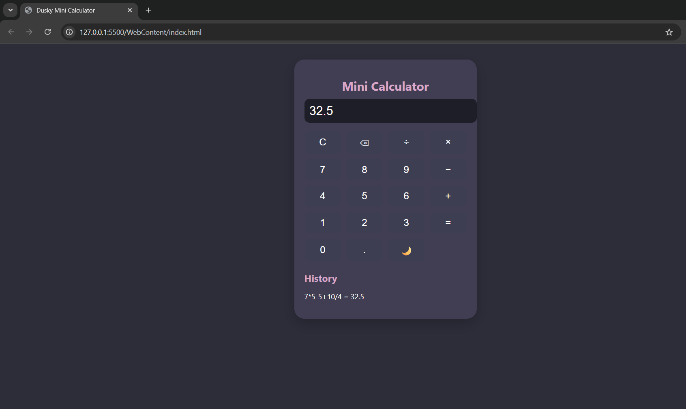

# Dusky Mini Calculator 🌙

A clean, moody-themed calculator built with HTML, CSS, and JavaScript.

### ✨ Features
- Arithmetic operations
- Keyboard support
- History log of previous calculations
- Light/Dark theme toggle
- Fully responsive layout

### 📸 Preview

### 🔗 Live Demo
Hosted via GitHub Pages: [Click Here](https://prajaktak4.github.io/mini-calculator/)

---

### 🛠️ Tech Stack
- HTML5
- CSS
- JavaScript

---

### 🚀 How to Run
1. Clone this repo
2. Open `index.html` in your browser
3. Or deploy it via GitHub Pages

---

### 📥 To Contribute
Feel free to fork & enhance.

---

### 💖 Made by Prajakta Kamboj
